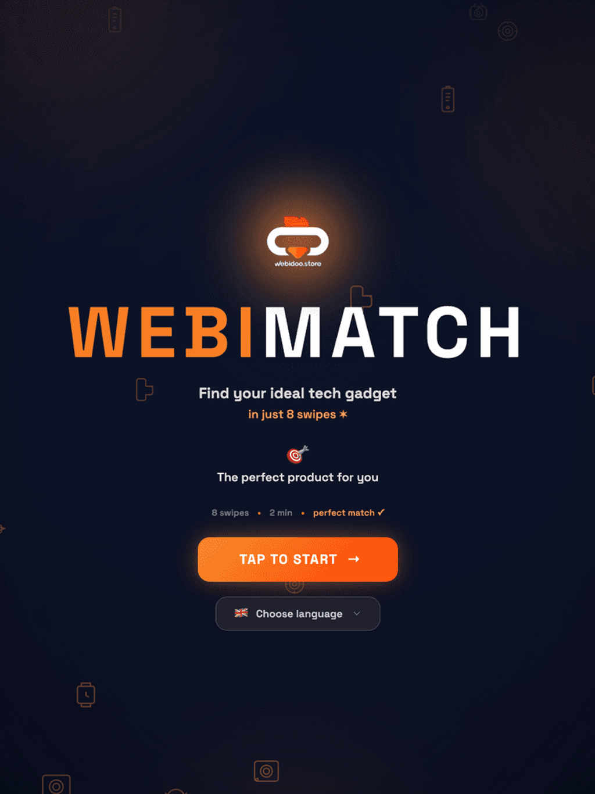
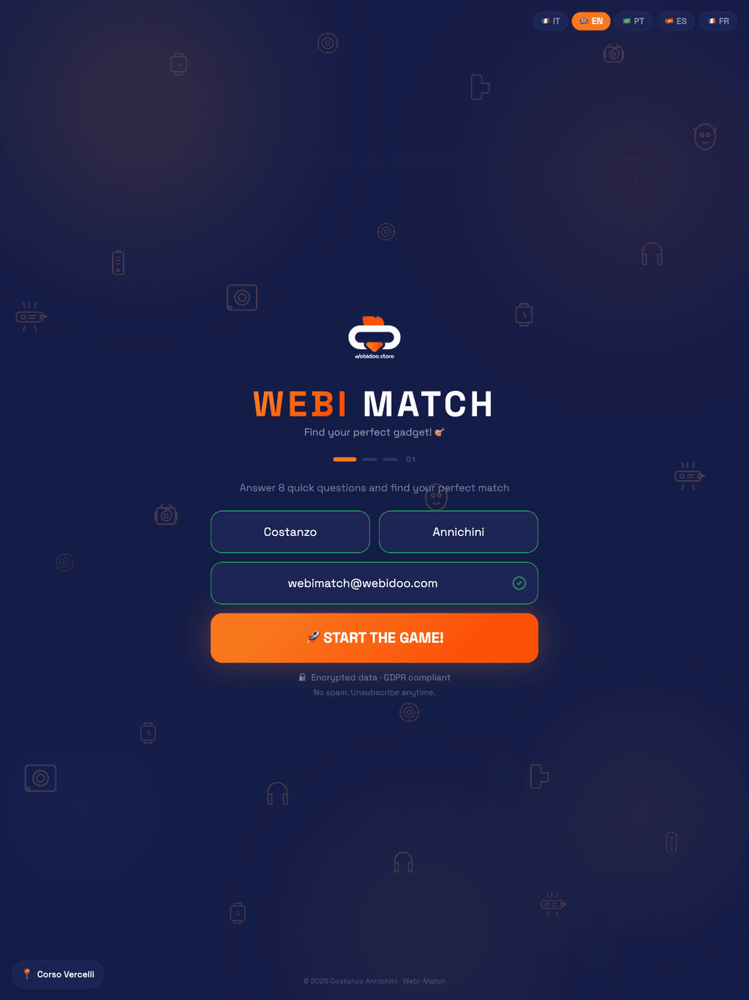
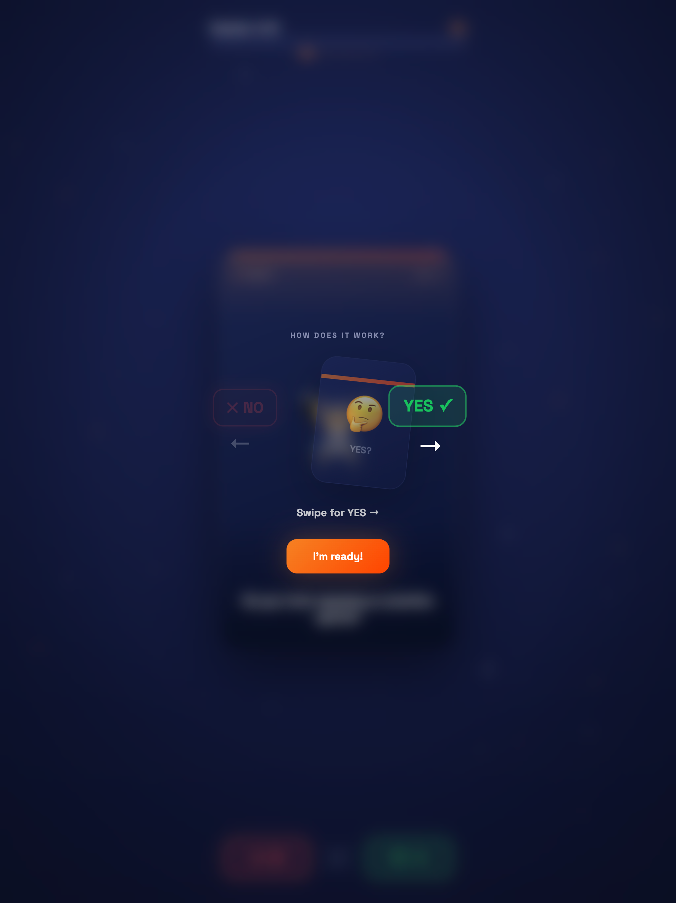
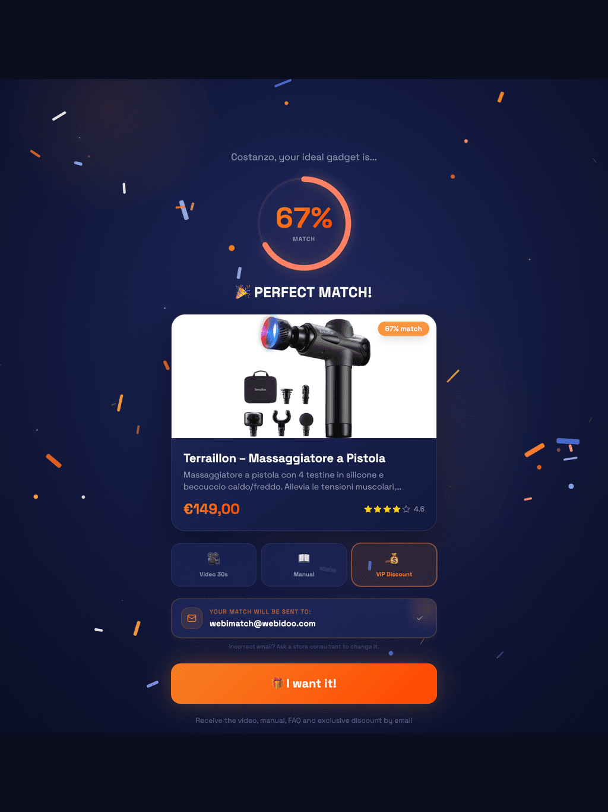
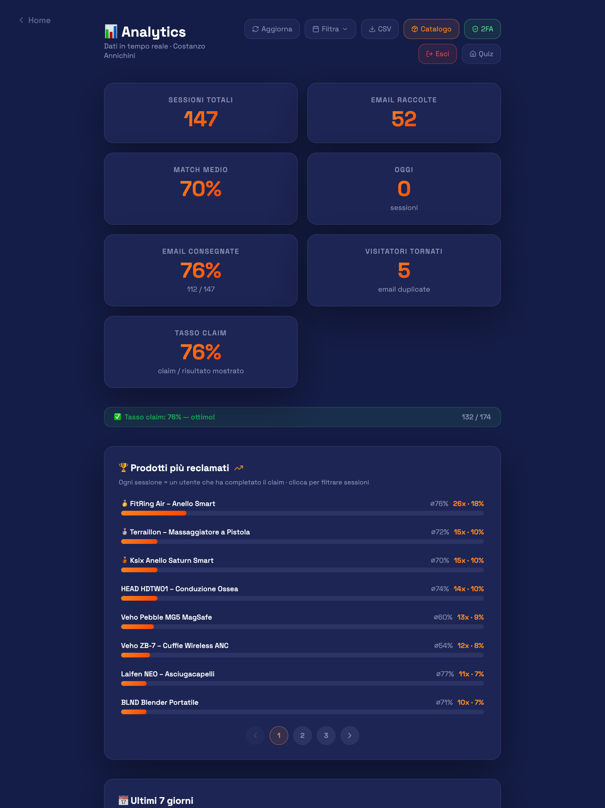
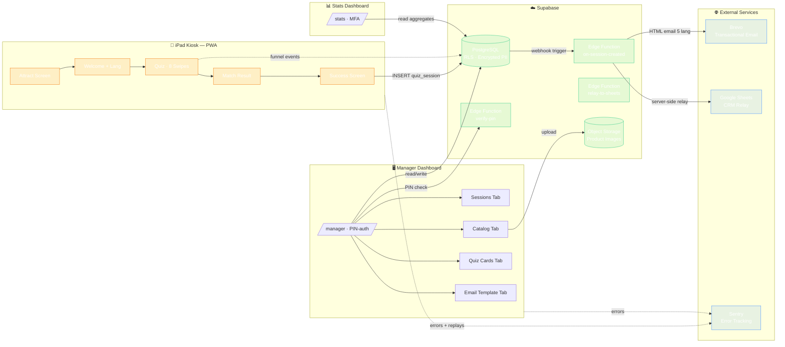

<div align="center">

# 🎯 Webi-Match

**An iPad-first product discovery kiosk for Webidoo Store**

[](https://github.com/ProgAnakin/webi-match/actions/workflows/ci.yml)
[](./src/__tests__)
[](./src/i18n/translations.ts)
[](https://www.typescriptlang.org/)
[](https://react.dev/)
[](https://supabase.com/)
[](./LICENSE)

*Customers swipe through 8 personalised questions — Tinder-style — and receive an instant product recommendation with a tailored discount and a personalised video from a consultant.*

### 🌐 [**Live Demo → webi-match.vercel.app**](https://webi-match.vercel.app)

*Best experienced on iPad (1024×1366) in landscape · Works on any modern browser*

</div>

---

## 💡 The Story Behind The Project

I'm **Costanzo Annichini** — Tech Sales & Customer Success at **Webidoo Store**. While working on the shop floor I noticed something simple but frustrating: the iPads installed in our stores were there to engage customers, but no one really used them. They sat unused next to the merchandise, waiting for a reason to be touched.

So I decided to build that reason — **on my own initiative, on my own time, with no brief, no specs, and no requests from above**. I designed, architected and shipped this project end-to-end: from the swipe interaction and the matching algorithm to the Supabase backend, the email automation, the multi-store manager dashboard, the security model and the PWA deployment.

The goal: give customers a playful 2-minute experience that ends with a personalised gadget recommendation, a discount code, and a follow-up email — turning idle iPads into a conversion-driving touchpoint that benefits both customers and the consultants who work alongside them.

— **Costanzo Annichini** · Tech Sales & Customer Success @ Webidoo Store

---

## 📸 Demo

> Live deployment running daily across multiple Webidoo Store locations on iPad.

<table align="center">
  <tr>
    <td align="center"><b>Attract loop</b></td>
    <td align="center"><b>Welcome</b></td>
    <td align="center"><b>Quiz</b></td>
    <td align="center"><b>Match Result</b></td>
    <td align="center"><b>Manager Dashboard</b></td>
  </tr>
  <tr>
    <td></td>
    <td></td>
    <td></td>
    <td></td>
    <td></td>
  </tr>
</table>

---

## 🏗️ Architecture



**Data flow at a glance:**

1. Customer completes quiz → `quiz_sessions` row inserted
2. Database webhook fires `on-session-created` Edge Function
3. Edge Function generates a unique discount code, encrypts PII at rest, builds a multilingual HTML email and dispatches it via Brevo
4. The same Edge Function relays the lead to Google Sheets (CRM)
5. Manager dashboard observes everything in real-time via Supabase Realtime subscriptions

---

## ✨ Features

### Customer-facing (kiosk)
- 🃏 **Tinder-style swipe quiz** — 8 questions, gesture-driven, haptic feedback
- 🌍 **5 languages** — Italian, English, Portuguese, Spanish, French
- 🧠 **Deterministic matching algorithm** — weighted scoring across 8 product categories with random tie-break
- 🎁 **Personalised discount codes** — unique per session, configurable TTL (6h / 12h / 24h / 48h / 72h)
- 📧 **Multilingual automated emails** — product info, consultant video, discount, FAQ — all translated to the language the customer picked
- 🎵 **Synthesised ambient soundtrack** — Web Audio API generative music, zero audio assets
- 💤 **Inactivity reset** — auto-returns to attract loop after 45s of idle (90s on result screen)
- 🔒 **Wake lock** — prevents iPad screen from sleeping
- 📵 **Offline-capable PWA** — service worker, runtime cache, graceful degradation

### Manager dashboard (`/manager`)
- 📊 **Real-time sessions** — live updates via Supabase Realtime, KPI cards, advanced filters (date, product, match %), CSV export, retention purge
- 🛍️ **Product catalogue** — slug-collision-safe custom products, per-store overrides (price, image, video, discount %), drag-and-drop quiz cards
- ✉️ **Email template editor** — live preview, configurable code TTL
- 🏪 **Multi-store support** — per-store activation, role-based access (`manager` sees all, `consulente_responsabile` sees own store)
- ⌨️ **Keyboard shortcuts** — `Ctrl+S` refresh, `Esc` close modals

### Stats dashboard (`/stats`)
- 📈 **Funnel analysis** — `quiz_started → result_shown → claimed` conversion
- 📦 **Product performance** — match distribution, redemption rate, lead volume
- 🏬 **Per-store breakdowns** — comparative store analytics

---

## 🛡️ Security & Quality Highlights

| Category | Implementation |
|---|---|
| **Authentication** | Supabase Auth · PIN + bcrypt fallback · in-memory IP-based lockout · MFA for stats |
| **Authorisation** | Row-Level Security on every table · role-based access (`manager` / `consulente_responsabile`) · per-store data isolation |
| **PII Protection** | AES encryption at rest for `nome`/`cognome` · SHA-256 email hashing for lookups · keys stored as Edge Function secrets |
| **Rate Limiting** | Server-side enforced 1-email-per-hour per address · cannot be bypassed from client |
| **Injection Defence** | All search inputs escape `%` `_` `\` before PostgREST `.or()` interpolation · `escHtml()` in every email template field |
| **CORS** | Strict origin allowlist · no wildcard fallback · silent rejection of unexpected origins |
| **Webhooks** | DB webhooks gated by valid `store_id` allowlist · unknown stores silently dropped |
| **Accessibility** | Kiosk-targeted tap targets (≥ 64 px on the PIN keypad and quiz buttons) · `focus-visible:ring-2` rings on interactive elements · `prefers-reduced-motion` respected via Framer Motion `MotionConfig` · informational copy bumped above the `/65` opacity threshold for in-store lighting |
| **Internationalisation** | 5 fully translated languages, including the transactional emails sent to customers |
| **Testing** | 75 unit tests (Vitest) · 8 E2E tests (Playwright) · typecheck + lint + build on every push via GitHub Actions |
| **Observability** | Sentry error tracking + session replay · structured logging in Edge Functions |
| **Performance** | Manual chunk splitting · lazy-loaded admin routes · image auto-resize ≤ 1024px JPEG q=80 · PWA precaching · debounced search |
| **iPad / Kiosk** | `interactive-widget=resizes-content` prevents URL bar on keyboard · `visualViewport` API for keyboard-aware layouts · iOS splash screens · wake lock · `100dvh` everywhere |

---

## ⚡ Performance

| Concern | Approach | Notes |
|---|---|---|
| **Bundle (main chunk)** | ~60 KB gzip | Manual `manualChunks` splits react-vendor, framer-motion, supabase and radix into separate cacheable chunks; admin routes lazy-loaded |
| **LCP** | Attract screen paints from CSS only | No image in the critical path |
| **PWA** | Full manifest + service worker + runtime cache | Installable on iPad standalone |
| **Image pipeline** | Auto-resize ≤ 1024 px JPEG q=80 | Runs in the manager catalog before Supabase Storage upload |
| **Search debounce** | 300 ms | Prevents a DB hit on every keystroke |
| **Animation budget** | ≤ 0.15 s stagger | Capped to prevent jank on 20+ row session lists on iPad |

> Run `npx lighthouse https://webi-match.vercel.app --view` to benchmark on your own network.

---

## 🗂️ Architecture Decision Records

Key architectural trade-offs are documented in [`docs/adr/`](./docs/adr/):

| ADR | Decision |
|-----|---------|
| [001](./docs/adr/001-supabase-over-firebase.md) | Supabase (PostgreSQL + RLS + pgcrypto) over Firebase |
| [002](./docs/adr/002-pwa-over-native.md) | PWA over native iOS app (with Capacitor escape hatch) |
| [003](./docs/adr/003-pii-encryption-at-rest.md) | PII encryption at the database layer (pgp_sym_encrypt + SHA-256) |
| [004](./docs/adr/004-swipe-quiz-over-form.md) | Tinder-style swipe quiz over a traditional form |

---

## 🧰 Tech Stack

| Layer | Technology |
|-------|-----------|
| **Framework** | React 18 + TypeScript |
| **Build** | Vite + SWC |
| **Animations** | Framer Motion (with `reducedMotion="user"`) |
| **Styling** | Tailwind CSS + shadcn/ui |
| **State** | React Query · Context |
| **Backend** | Supabase (PostgreSQL + Edge Functions + RLS + Storage + Realtime) |
| **Email** | Brevo (transactional API) |
| **CRM** | Google Sheets (server-side relay) |
| **Audio** | Web Audio API (synthesised generative loop) |
| **Errors** | Sentry (browser tracing + replays) |
| **PWA** | vite-plugin-pwa + Workbox |
| **Drag & Drop** | @dnd-kit/core + @dnd-kit/sortable |
| **Tests** | Vitest + Testing Library + Playwright |
| **CI** | GitHub Actions (typecheck · lint · test · build) |
| **Deploy** | Vercel (auto-deploy on push to `main`) |
| **Native** | Capacitor (iOS + Android builds supported) |

---

## 📁 Project Structure

```
src/
├── assets/              # Static brand assets (logo, envelope image)
├── components/
│   ├── ui/              # shadcn/ui base components
│   ├── manager/         # Manager dashboard (sessions, catalog, quiz cards, email)
│   ├── stats/           # Analytics dashboard components
│   ├── AttractScreen    # Idle attract loop
│   ├── WelcomeScreen    # Language selection + data capture
│   ├── QuizScreen       # 8-question swipe quiz orchestrator
│   ├── SwipeCard        # Individual Tinder-style card
│   ├── MatchResult      # Product recommendation display
│   ├── SuccessScreen    # Post-claim confirmation
│   └── ErrorBoundary    # App-level crash recovery screen
├── data/
│   ├── products.ts      # Product catalog + matching algorithm
│   ├── quiz-cards.ts    # Dynamic quiz question schema
│   └── stores.ts        # Store configuration
├── hooks/               # useDebounce, useWakeLock, useInactivityReset, useBgMusic, useViewportKeyboard…
├── i18n/                # Full translations in 5 languages
├── integrations/        # Supabase client + generated types
├── lib/                 # imageProcessing, startupCache, emailTemplate, utils
└── pages/               # Route-level page components

supabase/
├── functions/
│   ├── on-session-created/   # Email dispatch · PII encryption · CRM relay · multilingual templates
│   ├── verify-pin/           # Staff PIN auth with IP-based lockout
│   └── relay-to-sheets/      # Google Sheets relay (JWT-authenticated)
└── migrations/               # Versioned SQL migrations (RLS, encryption, rate limits, RPC functions)
```

---

## 🚀 Getting Started

### Prerequisites

- Node.js 20+
- npm
- Supabase project (URL + anon key)

### Local Setup

```bash
git clone https://github.com/ProgAnakin/webi-match.git
cd webi-match
npm install
cp .env.example .env
# Add VITE_SUPABASE_URL and VITE_SUPABASE_ANON_KEY
npm run dev
```

### Environment Variables

```env
VITE_SUPABASE_URL=https://your-project.supabase.co
VITE_SUPABASE_PUBLISHABLE_KEY=sb_publishable_...
VITE_SENTRY_DSN=https://your-sentry-dsn (optional)
```

### Available Scripts

| Command | Purpose |
|---------|---------|
| `npm run dev` | Vite dev server with HMR |
| `npm run build` | Production build |
| `npm run preview` | Preview production build locally |
| `npm test` | Run Vitest unit tests |
| `npm run lint` | ESLint check |
| `npm run cap:ios` | Build + open iOS Capacitor project |
| `npm run cap:android` | Build + open Android Capacitor project |

---

## 📦 Deployment

Auto-deploys on every push to the production branch via Vercel. Security headers, CSP, HSTS and SPA routing are declared in `vercel.json`.

The CI workflow runs typecheck, lint, test and build on every push to `main`, every PR, and every `claude/*` / `feat/*` / `fix/*` branch.

---

## 🗄️ Database

| Table | Purpose |
|-------|---------|
| `quiz_sessions` | One row per completed quiz — email, answers, matched product, store, discount code, language |
| `quiz_funnel_events` | Conversion funnel tracking (`quiz_started` / `result_shown` / `claimed`) |
| `product_settings` | Per-store product activation, pricing, images, videos, discounts, FAQ |
| `custom_products` | Per-store custom products (with collision-safe slug IDs) |
| `quiz_cards` | Dynamic quiz question schema with drag-and-drop ordering |
| `email_template` | Editable email template (subject, header title, subtitle, footer) |
| `store_roles` | Role-based access mapping (`manager` / `consulente_responsabile`) |
| `manager_audit_log` | Dashboard action audit trail |
| `admin_access_log` | PIN access tracking with IP + user-agent |
| `app_settings` | Encrypted application secrets (PIN hash) |

Every table is protected by Row-Level Security. Rate limiting is enforced at the database-function level. PII columns are AES-encrypted at rest.

---

## 🛣️ Admin Routes

| Route | Access | Purpose |
|-------|--------|---------|
| `/manager` | PIN-protected | Product, quiz card, store and email-template configuration · session & code tracking |
| `/stats` | MFA-protected | Session data, funnel metrics, per-store performance |
| `/reset-password` | Public | Password reset flow |

---

## 🖼️ Product Images

Place core product images in `public/products/` and reference them in `src/data/products.ts`. Recommended format: PNG, 600×600px, transparent background. Per-store images can be overridden via the Manager Dashboard (uploaded to Supabase Storage and auto-resized to 1024px JPEG, q=80).

---

## 📜 License

Proprietary — © Costanzo Annichini. All rights reserved.

This project was conceived, designed and built end-to-end by Costanzo Annichini as an independent initiative to enrich the in-store experience at Webidoo Store. It is not affiliated with, sponsored by or representative of any official Webidoo product.

---

## 👤 Author

**Costanzo Annichini** — Tech Sales & Customer Success @ Webidoo Store

A side-of-the-desk project, built to give customers a reason to actually touch the iPads in store. Architected and shipped solo — from swipe interaction to database security model to multilingual email automation. The codebase is the engineering output of someone whose job description doesn't include shipping software.

- **GitHub:** [github.com/ProgAnakin](https://github.com/ProgAnakin)
- **LinkedIn:** [linkedin.com/in/costanzoannichini](https://www.linkedin.com/in/costanzoannichini/)

Architectural trade-offs are documented in [`docs/adr/`](./docs/adr/); operational triage in [`docs/runbook.md`](./docs/runbook.md). Happy to discuss any of it.
